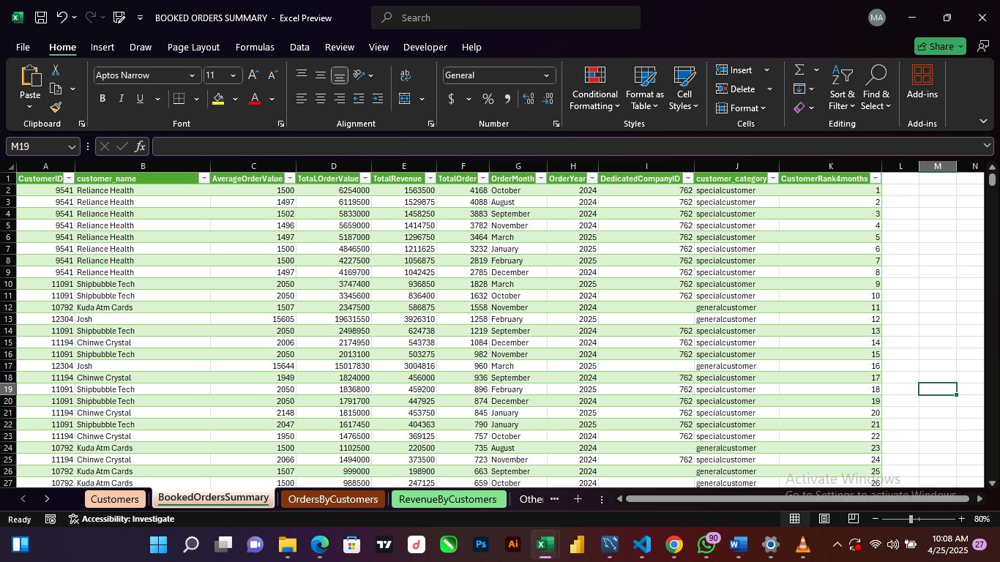
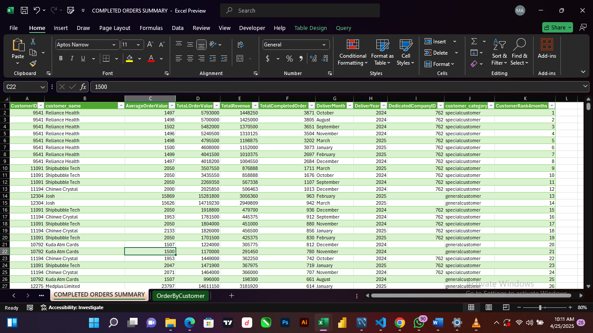

# Logistics Company Customers Monthly Booking Analysis

## Introduction
This is sql project on customers order booking,this project is to analyse, identify customers order trends
summarise total orders booked by customers and generate insights from the data between august 2024 and march 2025

## Problem statement
1. identify each total orders booked by customers in each month
2. identify each total revenue by customers in each month
3. identify each average order value by customers in each month
4. identify each order value by customers in each month 

## Techniques
the following concepts are used:
1. subqueries
2. aggregration functions
3. window functions
4. set operators

## Queried table
the below images show the total numbers of orders booked by customers, order value, average order value and total revenue
for the period of august 2024 to march 2025 

the below images show the total numbers of completed orders by customers, order value, average order value and total revenue
for the period of august 2024 to march 2025 

## Exploration data analysis and insights
customers
1. they are 224 customers that booked at least one orders between august2024 and march 2025
2. reliance health is the customers with the highest booked orders followed by shipbubble tech
3. reliance health is the customers with the highest revenue followed by josh and medplus limited
   for the case of josh and medplus limited the order volume is always large and they`re majorly interstate
customers category
1. special customers have the highest booked orders than general customers because they booked orders in bulk
month 

   
